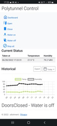

# Allotment introduction 
This is a repo for my pet project that automates a Polytunnel, it supports:
1. Opening and closing doors
2. Watering the plants
3. Reading temperature and humidity 
3. Checking water levels in the water butt (still in development)

 

## Setup
The web application runs in the Polytunnel on a Raspberry Pi in a Dockerized container (Portainer) using IO ports to read sensors, control doors and activate a water pump. There is an old phone that provides the internet via a hotspot. A static IP address is provided by a reverse proxy on an Oracle cloud server giving access to the web app via the general internet.
## Authentication & debug running
In debug mode authentication is disabled (in app settings) and a mocked machine is constructed so that debugging is made easier. In release I use Azure AD IDP and the real machine that connects to the IO ports.
## Code Quality
This is a skunk works style project so production quality aspects are missing currently, Unit tests, Sonarqube code quality analyses, pipeline etc.  Work in progress 😊

